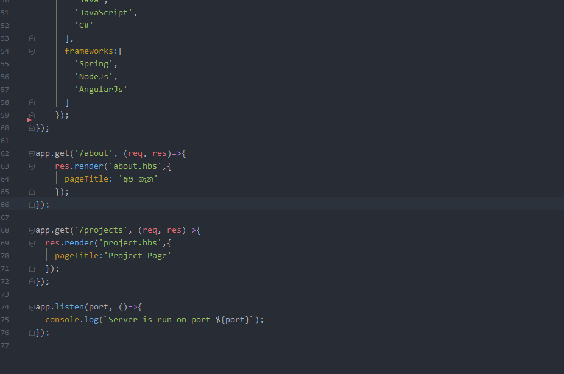

# atom-color-schema-for-intellij

## Installation

1. Go to File | Import Settings... and specify the directory or the settings.jar file. Click OK in the dialog that appears.

2. Restart IntelliJ IDEA

3. Go to Preferences | Editor | Colors & Fonts and select one of the new color themes.

